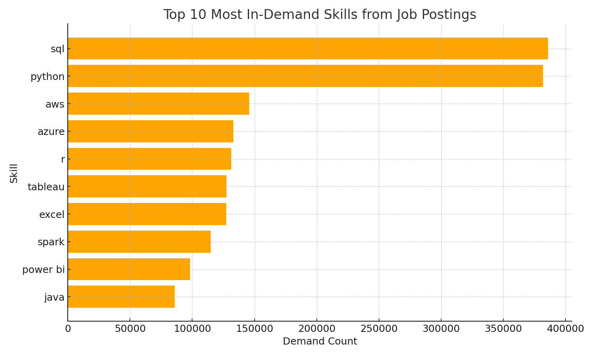
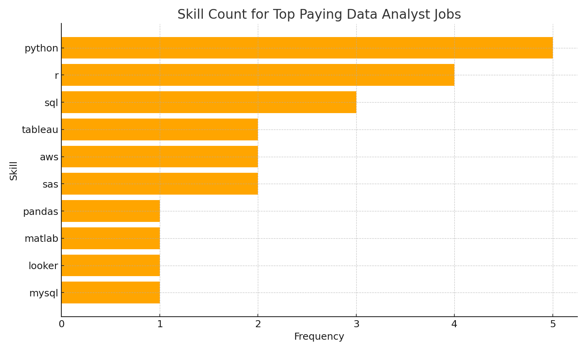

### SQL_Project_Job_Analysis
# Overview
This project analyzes job postings for Data Analyst roles to identify top in-demand skills, top-paying skills, optimal skills (balancing demand and salary), and related insights. The analysis is based on SQL queries run against a database containing job postings data. The database schema includes tables like job_postings_fact, skills_job_dim, skills_dim, and company_dim.
Key insights include:

 - Most in-demand skills across all job postings.
 - Skills associated with the highest-paying Data Analyst jobs.
 - A combination of high-demand and high-salary skills for optimal career choices.

Visualizations (bar charts) are provided to illustrate the findings.
Database Schema Overview

job_postings_fact: Contains job details like job_id, job_title, job_location, salary_year_avg, job_posted_date, etc.
skills_job_dim: Joins jobs to skills via job_id and skill_id.
skills_dim: Contains skill details like skill_id and skills (skill name).
company_dim: Contains company details like company_id and name.

# SQL Queries
Below are the SQL queries used in this analysis, along with their purposes.
**1. Top Demand Skills (top_demand_skill.sql)**
This query retrieves the top 10 most in-demand skills based on the count of job postings mentioning each skill.

```sql
SELECT skills, COUNT(skills_job_dim.job_id) AS demand_count
FROM job_postings_fact
INNER JOIN skills_job_dim ON job_postings_fact.job_id = skills_job_dim.job_id
INNER JOIN skills_dim ON skills_job_dim.skill_id = skills_dim.skill_id
GROUP BY skills
ORDER BY demand_count DESC
LIMIT 10;
```
 **Visualization**
A bar chart titled "Top 10 Most In-Demand Skills from Job Postings" shows skills on the y-axis (e.g., sql, python, aws, azure, r, tableau, excel, spark, power bi, java) and demand count on the x-axis (ranging from 0 to 400,000). SQL has the highest demand, followed closely by Python.

**2. Top Paying Job Skills (top_paying_job_skills.sql)**
This query joins top-paying Data Analyst jobs (remote/anywhere locations) with their associated skills, limited to 30 results ordered by salary.

```sql
WITH top_paying_jobs AS (
    SELECT job_id, name AS company_name, job_title, salary_year_avg, job_posted_date
    FROM job_postings_fact 
    LEFT JOIN company_dim ON job_postings_fact.company_id = company_dim.company_id
    WHERE job_title = 'Data Analyst' 
    AND job_location = 'Anywhere'
    AND salary_year_avg IS NOT NULL
    ORDER BY salary_year_avg DESC
)

SELECT top_paying_jobs.*, skills_dim.skills AS skill_name
FROM top_paying_jobs
INNER JOIN skills_job_dim ON top_paying_jobs.job_id = skills_job_dim.job_id
INNER JOIN skills_dim ON skills_job_dim.skill_id = skills_dim.skill_id
ORDER BY top_paying_jobs.salary_year_avg DESC
LIMIT 30;
```
**Example Output (CSV/JSON Format)**
Here is a sample of the data in JSON array format (can be converted to CSV):
```json
[
  {
    "job_id": 712473,
    "company_name": "Get It Recruit - Information Technology",
    "job_title": "Data Analyst",
    "salary_year_avg": "165000.0",
    "job_posted_date": "2023-08-14 16:01:19",
    "skill_name": "sql"
  },
  {
    "job_id": 712473,
    "company_name": "Get It Recruit - Information Technology",
    "job_title": "Data Analyst",
    "salary_year_avg": "165000.0",
    "job_posted_date": "2023-08-14 16:01:19",
    "skill_name": "python"
  },
  {
    "job_id": 712473,
    "company_name": "Get It Recruit - Information Technology",
    "job_title": "Data Analyst",
    "salary_year_avg": "165000.0",
    "job_posted_date": "2023-08-14 16:01:19",
    "skill_name": "r"
  },
  {
    "job_id": 712473,
    "company_name": "Get It Recruit - Information Technology",
    "job_title": "Data Analyst",
    "salary_year_avg": "165000.0",
    "job_posted_date": "2023-08-14 16:01:19",
    "skill_name": "sas"
  },
  {
    "job_id": 712473,
    "company_name": "Get It Recruit - Information Technology",
    "job_title": "Data Analyst",
    "salary_year_avg": "165000.0",
    "job_posted_date": "2023-08-14 16:01:19",
    "skill_name": "matlab"
  },
  {
    "job_id": 712473,
    "company_name": "Get It Recruit - Information Technology",
    "job_title": "Data Analyst",
    "salary_year_avg": "165000.0",
    "job_posted_date": "2023-08-14 16:01:19",
    "skill_name": "pandas"
  },
  {
    "job_id": 712473,
    "company_name": "Get It Recruit - Information Technology",
    "job_title": "Data Analyst",
    "salary_year_avg": "165000.0",
    "job_posted_date": "2023-08-14 16:01:19",
    "skill_name": "tableau"
  },
  {
    "job_id": 712473,
    "company_name": "Get It Recruit - Information Technology",
    "job_title": "Data Analyst",
    "salary_year_avg": "165000.0",
    "job_posted_date": "2023-08-14 16:01:19",
    "skill_name": "looker"
  },
  {
    "job_id": 712473,
    "company_name": "Get It Recruit - Information Technology",
    "job_title": "Data Analyst",
    "salary_year_avg": "165000.0",
    "job_posted_date": "2023-08-14 16:01:19",
    "skill_name": "sas"
  },
  {
    "job_id": 1246069,
    "company_name": "Plexus Resource Solutions",
    "job_title": "Data Analyst",
    "salary_year_avg": "165000.0",
    "job_posted_date": "2023-12-08 09:16:37",
    "skill_name": "python"
  },
  {
    "job_id": 1246069,
    "company_name": "Plexus Resource Solutions",
    "job_title": "Data Analyst",
    "salary_year_avg": "165000.0",
    "job_posted_date": "2023-12-08 09:16:37",
    "skill_name": "mysql"
  },
  {
    "job_id": 1246069,
    "company_name": "Plexus Resource Solutions",
    "job_title": "Data Analyst",
    "salary_year_avg": "165000.0",
    "job_posted_date": "2023-12-08 09:16:37",
    "skill_name": "aws"
  },
  {
    "job_id": 456042,
    "company_name": "Get It Recruit - Healthcare",
    "job_title": "Data Analyst",
    "salary_year_avg": "151500.0",
    "job_posted_date": "2023-09-25 10:59:56",
    "skill_name": "sql"
  },
  {
    "job_id": 456042,
    "company_name": "Get It Recruit - Healthcare",
    "job_title": "Data Analyst",
    "salary_year_avg": "151500.0",
    "job_posted_date": "2023-09-25 10:59:56",
    "skill_name": "python"
  },
  {
    "job_id": 456042,
    "company_name": "Get It Recruit - Healthcare",
    "job_title": "Data Analyst",
    "salary_year_avg": "151500.0",
    "job_posted_date": "2023-09-25 10:59:56",
    "skill_name": "r"
  },
  {
    "job_id": 405581,
    "company_name": "CyberCoders",
    "job_title": "Data Analyst",
    "salary_year_avg": "145000.0",
    "job_posted_date": "2023-05-01 13:00:20",
    "skill_name": "python"
  },
  {
    "job_id": 405581,
    "company_name": "CyberCoders",
    "job_title": "Data Analyst",
    "salary_year_avg": "145000.0",
    "job_posted_date": "2023-05-01 13:00:20",
    "skill_name": "java"
  },
  {
    "job_id": 405581,
    "company_name": "CyberCoders",
    "job_title": "Data Analyst",
    "salary_year_avg": "145000.0",
    "job_posted_date": "2023-05-01 13:00:20",
    "skill_name": "r"
  },
  {
    "job_id": 405581,
    "company_name": "CyberCoders",
    "job_title": "Data Analyst",
    "salary_year_avg": "145000.0",
    "job_posted_date": "2023-05-01 13:00:20",
    "skill_name": "javascript"
  },
  {
    "job_id": 405581,
    "company_name": "CyberCoders",
    "job_title": "Data Analyst",
    "salary_year_avg": "145000.0",
    "job_posted_date": "2023-05-01 13:00:20",
    "skill_name": "c++"
  },
  {
    "job_id": 405581,
    "company_name": "CyberCoders",
    "job_title": "Data Analyst",
    "salary_year_avg": "145000.0",
    "job_posted_date": "2023-05-01 13:00:20",
    "skill_name": "tableau"
  },
  {
    "job_id": 405581,
    "company_name": "CyberCoders",
    "job_title": "Data Analyst",
    "salary_year_avg": "145000.0",
    "job_posted_date": "2023-05-01 13:00:20",
    "skill_name": "power bi"
  },
  {
    "job_id": 405581,
    "company_name": "CyberCoders",
    "job_title": "Data Analyst",
    "salary_year_avg": "145000.0",
    "job_posted_date": "2023-05-01 13:00:20",
    "skill_name": "qlik"
  },
  {
    "job_id": 479485,
    "company_name": "Level",
    "job_title": "Data Analyst",
    "salary_year_avg": "145000.0",
    "job_posted_date": "2023-03-15 16:59:55",
    "skill_name": "sql"
  },
  {
    "job_id": 479485,
    "company_name": "Level",
    "job_title": "Data Analyst",
    "salary_year_avg": "145000.0",
    "job_posted_date": "2023-03-15 16:59:55",
    "skill_name": "python"
  },
  {
    "job_id": 479485,
    "company_name": "Level",
    "job_title": "Data Analyst",
    "salary_year_avg": "145000.0",
    "job_posted_date": "2023-03-15 16:59:55",
    "skill_name": "r"
  },
  {
    "job_id": 479485,
    "company_name": "Level",
    "job_title": "Data Analyst",
    "salary_year_avg": "145000.0",
    "job_posted_date": "2023-03-15 16:59:55",
    "skill_name": "golang"
  },
  {
    "job_id": 479485,
    "company_name": "Level",
    "job_title": "Data Analyst",
    "salary_year_avg": "145000.0",
    "job_posted_date": "2023-03-15 16:59:55",
    "skill_name": "elasticsearch"
  },
  {
    "job_id": 479485,
    "company_name": "Level",
    "job_title": "Data Analyst",
    "salary_year_avg": "145000.0",
    "job_posted_date": "2023-03-15 16:59:55",
    "skill_name": "aws"
  },
  {
    "job_id": 479485,
    "company_name": "Level",
    "job_title": "Data Analyst",
    "salary_year_avg": "145000.0",
    "job_posted_date": "2023-03-15 16:59:55",
    "skill_name": "bigquery"
  }
]
```
**Visualization**
A bar chart titled "Skill Count for Top Paying Data Analyst Jobs" shows skills on the y-axis (e.g., python, r, sql, tableau, aws, sas, pandas, matlab, looker, mysql) and frequency on the x-axis (ranging from 0 to 5). Python has the highest count.


**3. Top Paying Skills (top_paying_skills.sql)**
This query calculates the average salary for each skill in Data Analyst jobs, ordered descending, limited to 15.

```sql
SELECT skills, ROUND(AVG(salary_year_avg), 2) AS avg_salary
FROM job_postings_fact
INNER JOIN skills_job_dim ON job_postings_fact.job_id = skills_job_dim.job_id
INNER JOIN skills_dim ON skills_job_dim.skill_id = skills_dim.skill_id
WHERE salary_year_avg IS NOT NULL AND job_postings_fact.job_title_short = 'Data Analyst'
GROUP BY skills
ORDER BY avg_salary DESC
LIMIT 15;
```
**4. Top Paying Jobs (top_paying_jobs.sql)**
This query lists the top 10 highest-paying Data Analyst jobs (remote/anywhere locations).
```sql
SELECT job_id, name AS company_name, job_title, job_location, job_schedule_type, salary_year_avg, job_posted_date
FROM job_postings_fact 
LEFT JOIN company_dim ON job_postings_fact.company_id = company_dim.company_id
WHERE job_title LIKE '%Data Analyst%' 
AND job_location = 'Anywhere'
AND salary_year_avg IS NOT NULL
ORDER BY salary_year_avg DESC
LIMIT 10;
```
**5. Most Optimal Skills (most_optimal_skill.sql)**
This query identifies skills with high demand and high average salary for Data Analyst roles, ordered by demand then salary, limited to 20.

```sql
SELECT skills, COUNT(skills_job_dim.job_id) AS demand_count, ROUND(AVG(salary_year_avg), 2) AS avg_salary
FROM job_postings_fact
INNER JOIN skills_job_dim ON job_postings_fact.job_id = skills_job_dim.job_id
INNER JOIN skills_dim ON skills_job_dim.skill_id = skills_dim.skill_id
WHERE salary_year_avg IS NOT NULL 
AND job_postings_fact.job_title_short = 'Data Analyst'
GROUP BY skills, skills_job_dim.skill_id
ORDER BY demand_count DESC, avg_salary DESC
LIMIT 20;
```
# How to Run

Set up a database with the mentioned schema and populate it with job postings data.
Execute the SQL queries in your database tool (e.g., PostgreSQL, MySQL).
Use tools like Python (with libraries such as Matplotlib or Seaborn) to generate visualizations from the query results.

# Insights

Core Skills: SQL and Python dominate both demand and high-paying jobs.
Optimal Choices: Focus on skills like SQL, Python, R, and Tableau for a balance of demand and salary.
Data is from 2023 job postings; trends may evolve.

For questions or contributions, feel free to open an issue.